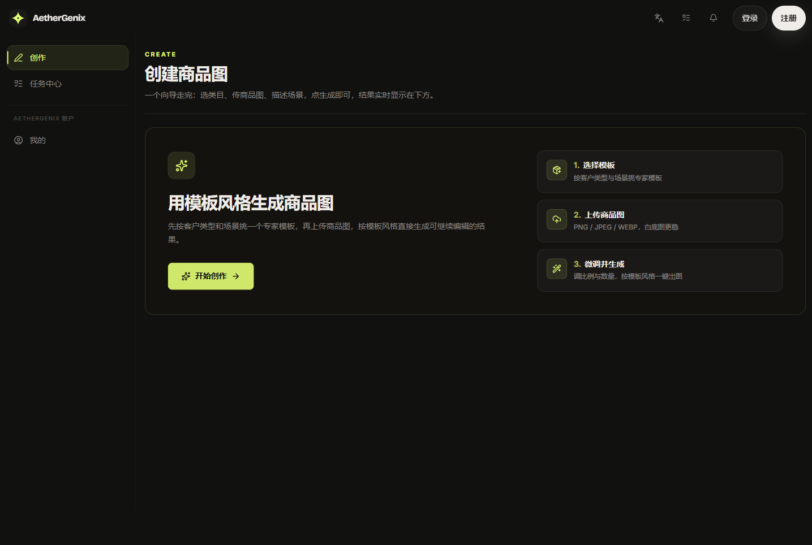

# P0 — Create 入口页

## 现状

进入 `/create` 看到的不是第一步操作，而是一张营销卡「用模板风格生成商品图 + 开始创作」+ 三步说明列表。再点一次「开始创作」才进入向导。右侧常驻"任务中心"栏。

实际文案：

- 副标题：「一个向导走完：**选类目**、传商品图、**描述场景**，点生成即可，结果实时显示在下方。」
- 卡片标题：「用**模板**风格生成商品图」
- 步骤①：「选择**模板**」

## 问题

- 🔴 **多余的一层。** 工作台不该有介绍页 —— 用户为创作而来，却被要求多点一次。违反 [P5]。
- 🔴 **同屏术语打架。** 类目 / 模板 / 场景（进向导后叫"选择场景"）/ 客户类型，一个概念四个词。违反 [P2]。
- 🟡 **承诺了不存在的步骤。** 副标题说第 3 步"描述场景"，真实第 3 步是"微调输出"（比例/数量）。
- 🟡 **重复。** 三步说明卡与向导自身的进度条信息重叠。

## 改版方案

**布局**：删除入口卡这一层，点「创作」直接渲染向导第 1 步（见 [P1 选择场景](./02-select-scene.md)）。若需一句引导，压成第 1 步标题下方一行。

**文案对齐**（before → after）：

- 副标题：~~选类目、传商品图、描述场景~~ → **「选场景 → 传商品图 → 微调出图，几步拿到能用的商品图」**
- 全量替换：模板/类目 → **场景**；客户类型 → **生意类型**。

**对应原则**：P2 P5　**批次**：Batch 1
