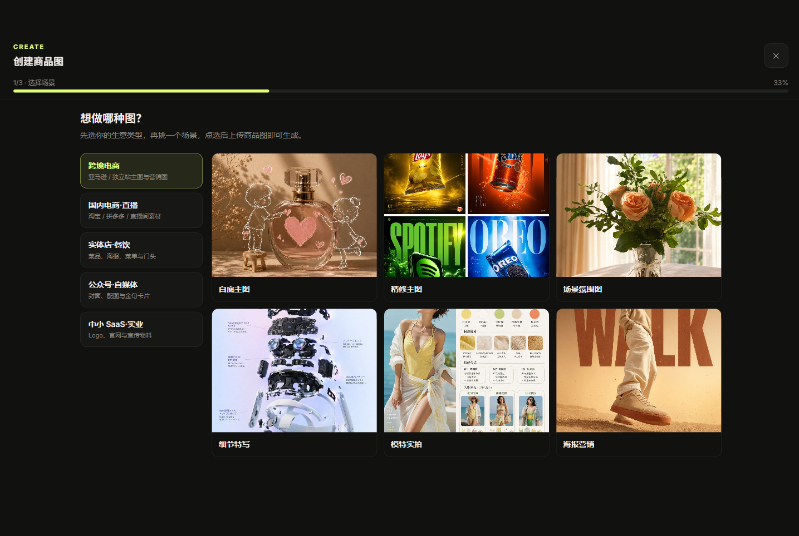

# P1 — 选择场景（向导第 1 步）



## 现状

进度 `1/3 · 选择场景`（33%）。标题「想做哪种图？」副标题「先选你的生意类型，再挑一个场景，点选后上传商品图即可生成。」左侧 5 个生意类型（纵向），右侧场景卡网格（图 + 标题 + 描述 + "使用 →"）。

5 个生意类型：跨境电商 / 国内电商·直播 / 实体店·餐饮 / 公众号·自媒体 / 中小 SaaS·实业。

## 问题

- 🟢 **正面**：两级收敛（生意类型→场景）方向对；场景卡有描述文案 + hover"使用 →"。
- 🟡 **分类轴不统一。** 渠道（跨境/国内电商）、业态（实体店·餐饮）、内容（公众号·自媒体）三种轴混在一起；"淘宝+直播"会同时落入多类 → 犹豫。违反 [P1]。
- 🟡 **无兜底。** 默认选中"跨境电商"，国内餐饮店主第一眼看到"亚马逊/独立站"会怀疑不是给自己用的；没有"不确定从哪开始"的入口。
- 🟡 **样例图信任不足。** 部分场景示意为 SVG 占位，而非真实出图 —— 模板优先流的全部说服力就在"预览这个场景出什么"。违反 [P3]。

## 改版方案

**生意类型**：改为单一轴（"卖家在哪用图"），并置顶兜底项：
```
最常用 / 不确定从这开始   ← 默认选中
电商主图 · 社媒种草 · 实体门店 · 内容封面 · 品牌物料
```

**场景卡**：真实样例图（before/after）+ 一行"用于…"结果描述；选中态用 lime 描边+浅底（[P2] 状态规范）。

**对应原则**：P1 P3 P6　**批次**：分类与兜底 Batch 1；真实样例图 Batch 2
