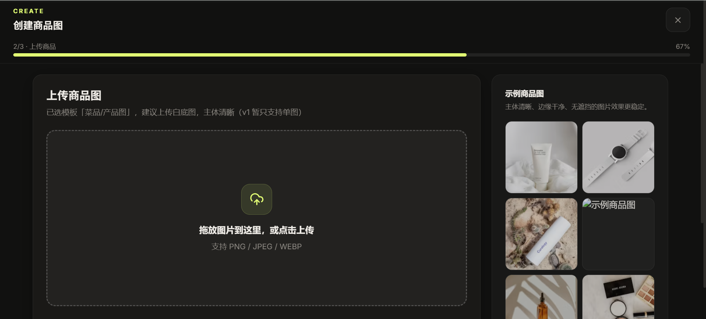

# P2 — 上传商品（向导第 2 步）

## 现状

进度 `2/3 · 上传商品`（67%）。左侧大拖拽区「拖放图片到这里，或点击上传 / 支持 PNG / JPEG / WEBP」；标题旁副标题「已选模板「X」，建议上传白底图，主体清晰（v1 暂只支持单图）」。右侧"示例商品图"列。

## 问题

- 🟡 **泄漏内部版本号。** 「（**v1** 暂只支持单图）」—— 用户不该看到版本规划，读起来像半成品。
- 🟡 **术语回退。** 又出现「模板」（应为「场景」）。违反 [P2]。
- 🟡 **对脏图无兜底。** 目标用户必然上传杂乱背景图，现在只有一句"建议白底"，没有正反例、没有自动处理说明。右侧"示例商品图"曾出现 alt 文字裸露（占位未出图）。

## 改版方案

**文案**（before → after）：
- ~~已选模板「X」，建议上传白底图，主体清晰（v1 暂只支持单图）~~
  → **已选场景「X」。上传清晰的商品图（目前支持单张），白底主体最稳。**

**示例区**：用真实"好图"示例 + 一句"这样的图效果最好"；补一组"不太行"的反例缩略（杂乱背景/糊/遮挡）。

**上传后**：清晰预览 + "重新上传"，状态不丢。

**对应原则**：P2 P3　**批次**：文案 Batch 1；正反例示例图 Batch 2
