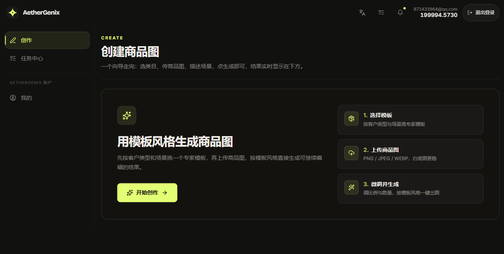

# P3 — 微调输出（向导第 3 步）



## 现状

进度 `3/3 · 微调输出`（100%）。标题「微调并生成」。含：商品图预览 + 重新上传、**额外要求（可选）** 文本框（placeholder："例如：背景换成浅灰、增加投影、突出logo等"）、**画面比例**（1:1 / 3:4 / 4:3 / 16:9 / 9:16）、**生成数量**（1–4 张）、上一步 / 生成图片。

## 问题

- 🟢 **正面**："额外要求"输入框做得好，placeholder 有范例，保留。
- 🟡 **无默认选中态。** 已用脚本验证：5 个比例 + 4 个数量按钮样式完全相同、无一高亮。用户面对一排未选中的按钮，不知"正常该选哪个"。违反 [P1]。
- 🟡 **无费用提示。** 全流程不显示积分/消耗，点"生成图片"前不知扣多少；数量直接关系花费。

## 改版方案

- **默认值**：进入即高亮 `1:1` + `1 张`，并标注"推荐"。用户可改但不必改（[P1]）。
- **费用透明**：在"生成图片"按钮上明示本次消耗与余额，如 **「生成 1 张 · 消耗 X · 余额 Y」**。
- 选中态统一 lime 描边+浅底（[P2] 状态规范）。

**对应原则**：P1 P2　**批次**：默认值 Batch 1；费用提示 Batch 2

## 实现索引

```text
src/components/ecommerce/CreateFlowWizard.tsx
└─ step=tune
   └─ TuneStep()
      ├─ SegmentedControl: 图片比例
      │  └─ 1:1 / 4:3 / 3:4 / 16:9 / 9:16
      ├─ SegmentedControl: 生成数量
      │  └─ 1 / 2 / 3 / 4 张
      ├─ CreditEstimate()
      │  └─ 显示余额 + 预计消耗
      ├─ 右侧场景预览
      │  └─ template.sampleImage / template.prompt
      └─ 生成
         └─ handleGenerate()
            └─ onComplete(WizardResult)

src/components/ecommerce/createWizardState.ts
├─ 默认 aspectRatio = 1:1    ← 待补“推荐”视觉
├─ 默认 imageCount = 1       ← 待补“推荐”视觉
└─ set_image_count 限制 1..4
```
