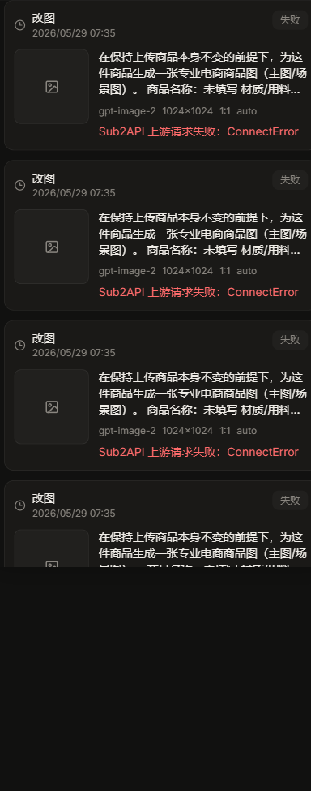

# P4 — 生成结果 / 失败态 + 右侧任务栏



> 该状态出现在 `/create` 页右侧常驻任务栏（也见整页图 `01-create-entry.png` 右侧）。

## 现状

登录后回到 `/create`，右侧任务栏直接是**多张红色"失败"卡片堆叠**，每张显示：

- 原始报错「**Sub2API 上游请求失败：ConnectError**」
- 完整内部 prompt 全文（大段英文 "Amazon-compliant e-commerce main image…" + "商品名称：未填写 材质：未填写…"）
- 元数据 gpt-image-2 / 1024x1024 / 1:1 / auto

任务栏从入口到出图全程占约 1/3 宽，且与左侧导航"任务中心"功能重复。

## 问题（新用户最劝退的一屏）

- 🔴 **原始技术错误甩给用户。** "Sub2API / ConnectError" 是内部名词，用户只会觉得"产品坏了"。违反 [P4]。
- 🔴 **暴露内部 prompt。** 整段提示工程不该外露。
- 🔴 **无重试入口、无友好兜底。** 上游本就抽风（已知上线瓶颈），失败态更要"温柔可重试"，现在是一面红墙。
- 🟡 **任务栏不让位。** 创作进行时仍占 1/3 宽，且与左导航重复。违反 [P5]。

## 改版方案

**失败卡**（before → after）：

- 标题：**「这次没生成成功」**
- 原因（人话）：**「出图服务繁忙，请重试」**
- 主按钮：**「重试」**（lime 主操作）
- 技术细节（ConnectError 等）收进可折叠"详情"，默认隐藏。
- **永不展示内部 prompt 全文**；最多回显用户自己填的"额外要求"。

**任务栏**：创作进行时收起/弱化，把宽度让给结果区；任务历史统一走左侧"任务中心"，消除重复。

**对应原则**：P4 P5　**批次**：失败态 Batch 2（实为真正上线卡点，建议提前）；任务栏让位 Batch 3

## 实现索引

```text
src/pages/Create.tsx
└─ ResultView()
   └─ TaskResultRow()
      ├─ status=failed
      │  └─ 显示 run.task.error        ← 待人话化
      └─ status!=failed
         └─ 显示生成图/占位

src/tasks.tsx
└─ TaskCenterProvider
   ├─ addTask()
   │  ├─ mergeTasks()
   │  └─ setDrawerOpen(true)          ← 待弱化
   ├─ refreshTasks()
   └─ poll active tasks
      └─ getImageTask()

src/components/TaskDrawer.tsx
└─ TaskDrawer()
   └─ displayTasks
      └─ 失败卡
         ├─ 显示 task.prompt           ← 待隐藏
         ├─ 显示 task.error            ← 待人话化
         └─ 无卡内重试                 ← 待补

src/components/TaskToastStack.tsx
└─ TaskToastStack()
   └─ failed toast
      └─ 优先显示 toast.error          ← 待人话化
```
